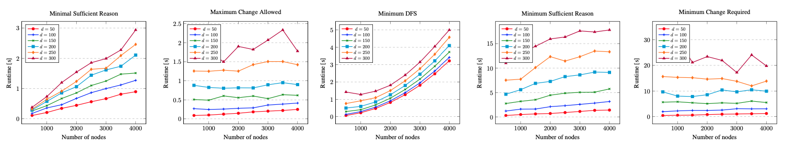

# Go-ExplainDT

Experiments to showcase the performance of the
[implementation](https://github.com/jtcaraball/goexpdt) based on the KR2024
submission "A Uniform Language to Explain Decision Trees".



## Docker

In order to have a uniform and OS-independent environment for code execution,
without requiring users to install SAT solvers on their computer, we use
"docker" containers. In order to run this project you must have
[docker](https://docs.docker.com/engine/install/) installed.

## Experiments

To build the docker image corresponding to the experiments, run the following
command:

```
make build
```

After that, experiments can be run with:

```
docker run --rm -v $(pwd)/io:/io goexpdt-exp <command> <args>
```
The `<command>` and `<args>` options are described below.

The experiment outputs will be written to `io/output` directory as csv files
with self-explanatory headers.

### Commands

The available commands for experiments are:

- `list`: List all implemented experiments.
- `info <experiment>`: Get experiment info and expected arguments.
- `<experiment> <args>`: Run experiment with arguments.

Each experiment has a name (string), and the existing experiments are listed
below.

### List of Experiments

We distinguish between two kinds of experiments, those for which the user
provides instances as part of the input and those that are based on sampling
random instances (denoted by de addition of `rand`).

- `optim:rand:stats:dfs-ll`: Optimum (Stats, Random Instances) - DFS under Lesser Level Order.
- `optim:rand:stats:sr-ll`: Optimum (Stats, Random Instances) - SR under Lesser Level Order.
- `optim:rand:stats:sr-ss`: Optimum (Stats, Random Instances) - SR under Strict Subsumption Order.
- `optim:rand:stats:cr-lh`: Optimum (Stats, Random Instances) - CR under Lesser Hamming Distance Order.
- `optim:rand:stats:ca-gh`: Optimum (Stats, Random Instances) - CA under Greater Hamming Distance Order.
- `optim:rand:val:dfs-ll`: Optimum (Value, Random Instances) - DFS under Lesser Level Order.
- `optim:val:dfs-ll`: Optimum (Value) - DFS under Lesser Level Order.
- `optim:val:sr-ll`: Optimum (Value) - SR under Lesser Level Order.
- `optim:val:sr-ss`: Optimum (Value) - SR under Strict Subsumption Order.
- `optim:val:cr-lh`: Optimum (Value) - CR under Less Hamming Distance Order.
- `optim:val:ca-gh`: Optimum (Value) - CA under Greater Hamming Distance Order.


### Input Types

Experiments may accept one of two file formats as inputs, both of which must
be in the `io/input` directory.

- **Tree file**: A json file representing a decision tree.
- **Optimization file**: A plain text file that must follow the format outlined
  bellow

  ```
  <tree_file_name>
  <instance_1>
  <instance_2>
  ...
  <instance_n>
  ```

  Here `<tree_file_name>` corresponds to the name of a Tree file in the input
  directory and `<instance_i>` to an instance represented as a word in the
  alphabet {0, 1, _} with _ meaning that a feature is a 'bottom'.

### Command Examples

In the `io/input` directory there are examples of tree and optimization file
inputs. Here are some of the experiments that can be ran on this inputs:

**Stats for 5 random positive instances for optimal Determinant Feature Set
over Less Level order**:

```
docker run --rm -v $(pwd)/io:/io goexpdt-exp optim:rand:stats:dfs-ll 5 mnist_d0_n400.json
```

**Values of optimal Changed Allowed over Greater Hamming distance order for
specific instances**:

```
docker run --rm -v $(pwd)/io:/io goexpdt-exp optim:val:ca-gh mnist_d0_input.txt
```
